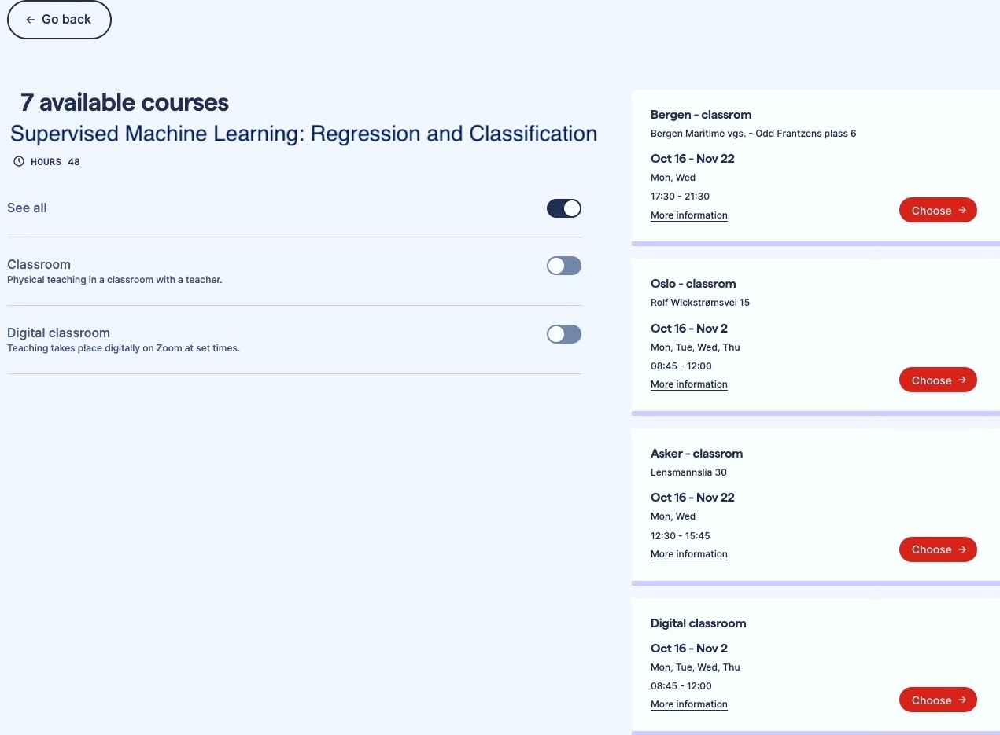

# NAIC Training Plan

This tutorial shows all the **events**[^note] related with the NAIC Training processes. Initial plan is to create a Training Plan in two different ways: **Asynchronous Courses** and **Synchronous Courses**.


## Asynchronous Courses

Those courses will be **asynchronous**. 

```{admonition} Examples
- The course name, content, duration, and video materials will be available.
- These courses can provide links to NRIS's HPC courses or CodeRefinery training [video](https://www.youtube.com/playlist?list=PLpLblYHCzJADyLxv8GRyxFiRJBhQ-G0NQ) recordings text files.
   


For Git Intro, such a CR playlist can be used:
<iframe width="560" height="315" src="https://www.youtube.com/embed/videoseries?si=Ey-QD4_rXvmwk9Wt&amp;list=PLpLblYHCzJADyLxv8GRyxFiRJBhQ-G0NQ" title="YouTube video player" frameborder="0" allow="accelerometer; autoplay; clipboard-write; encrypted-media; gyroscope; picture-in-picture; web-share" allowfullscreen></iframe>
```


## Synchronous Courses

Synchronous courses under this heading can be conducted in two ways:

```{admonition} Examples

```

### **1. Online Courses** 
- Periodic courses created according to a timeline.

```{admonition} Examples
We can include a few planned CR schedules here.
```

### **2. Physical Courses**
- For these courses, it is necessary to directly contact the personnel who will provide face-to-face instruction and discuss the frequency of their classes.

```{admonition} Examples
We don't have any examples for this yet, but there will be individuals who prefer this option, especially those who want to receive one-on-one and active instruction in environments like a LAB and ask questions to the instructor immediately.
```

[^note]:
    These are **Past** and **Upcoming** Events.